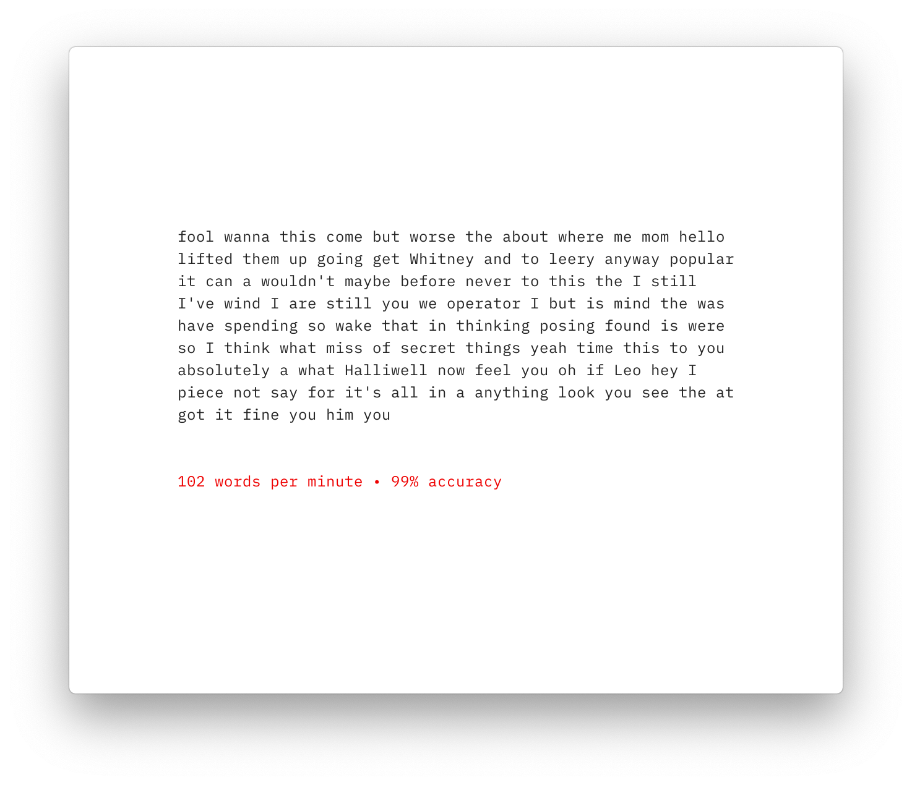
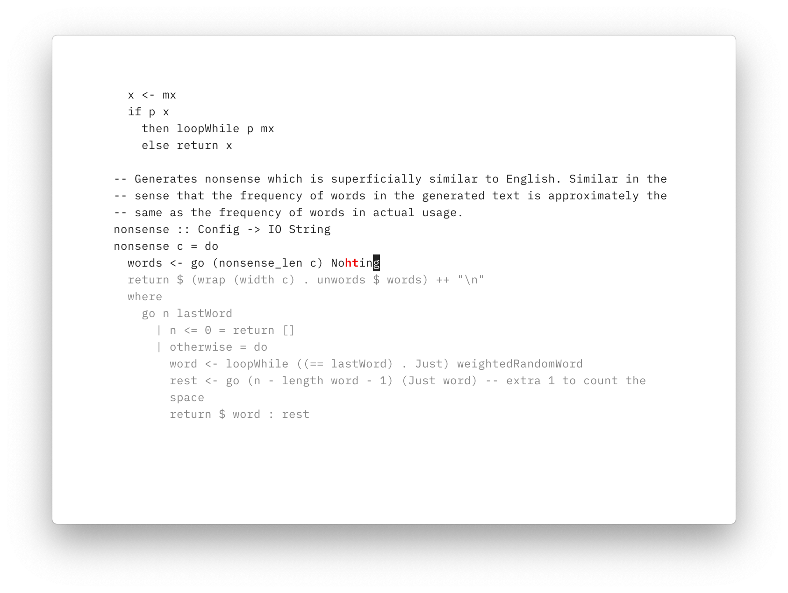
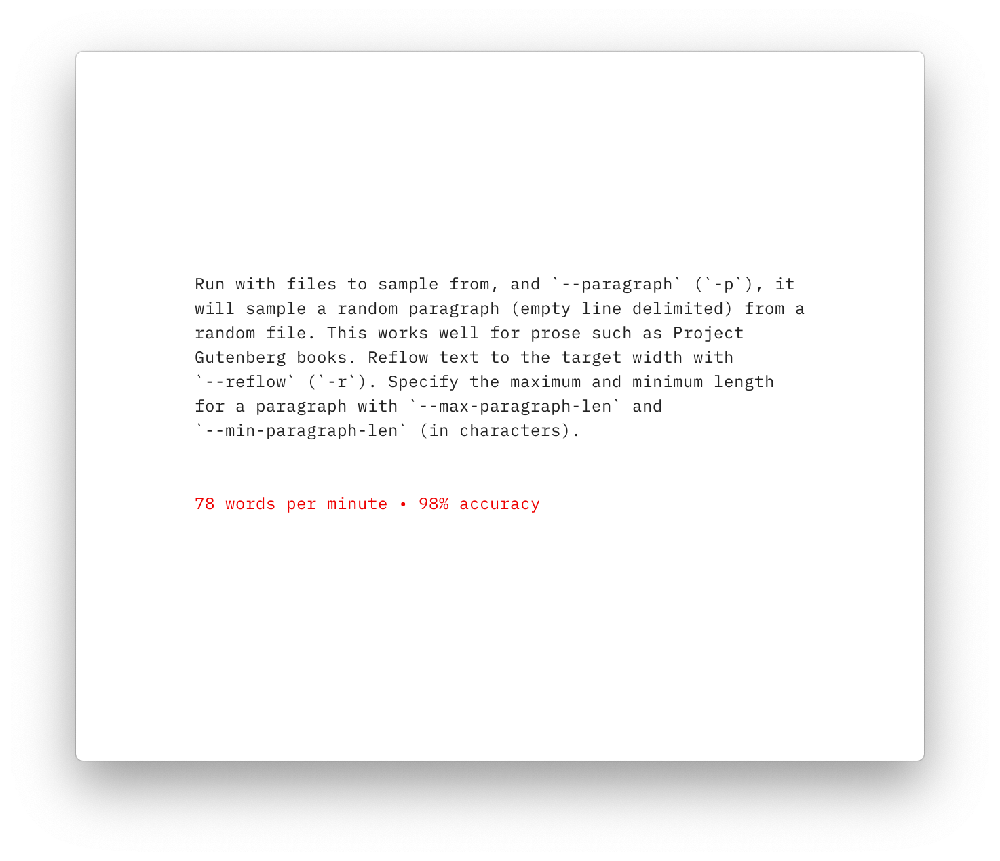

# Gotta Go Fast

A command line utility for practicing typing and measuring your WPM and
accuracy. Written with [brick](https://github.com/jtdaugherty/brick).

## Installation

From source:

    $ git clone https://github.com/callum-oakley/gotta-go-fast
    $ cd gotta-go-fast
    $ stack install

Download binary (macOS only for now):

    $ DEST=~/.local/bin/gotta-go-fast
    $ curl https://github.com/callum-oakley/gotta-go-fast/releases/download/v0.3.0.0/macos -fLo $DEST

Where `DEST` is somewhere in your `PATH`.

## Usage

`gotta-go-fast` has three modes of operation. In all three modes, type through the presented text and then submit with enter. You **must** correct your mistakes before you can submit.

### 1. Nonsense mode

Run with no file inputs, it will generate nonsense which is statistically similar to English text. Words appear in the nonsense with the same frequency that they appear in actual English. The length of the nonsense can be specified with `--nonsense-len` (`-l`) (in characters).

    $ gotta-go-fast -w 60

### 2. Chunk mode

Run with files to sample from, it will sample a random chunk from a random file as input. This works well for code or other text without a clear paragraph structure. Specify the height of the chunk in lines with `--height` (`-h`).

    $ gotta-go-fast src/*

### 3. Paragraph mode

Run with files to sample from, and `--paragraph` (`-p`), it will sample a random paragraph (empty line delimited) from a random file. This works well for prose such as Project Gutenberg books. Reflow text to the target width with `--reflow` (`-r`). Specify the maximum and minimum length for a paragraph with `--max-paragraph-len` and `--min-paragraph-len` (in characters).

    $ gotta-go-fast -prw 60 README.md

In all three modes the width of the text can be set with `--width` (`-w`), the tab width can be set with `--tab` (`-t`) and the colour of empty (not yet typed) text and of errors can be set with `--fg-empty` and `--fg-error` (ANSI colour codes).

Run with `--help` for details.
