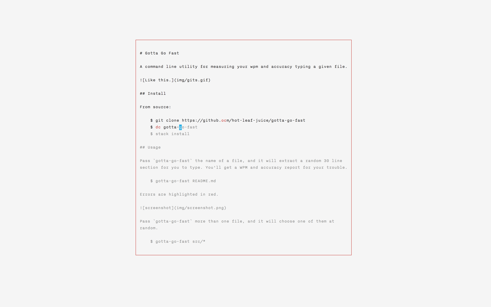

# Gotta Go Fast

A command line utility for practicing typing and measuring your WPM and
accuracy. Written with [brick](https://github.com/jtdaugherty/brick).

## Install

From source:

    $ git clone https://github.com/hot-leaf-juice/gotta-go-fast
    $ cd gotta-go-fast
    $ stack install

## Usage

Pass `gotta-go-fast` the name of a file, and it will extract a random 30 line
section for you to type. You'll get a WPM and accuracy report for your trouble.

    $ gotta-go-fast README.md

Errors are highlighted in red.

Pass `gotta-go-fast` more than one file, and it will choose one of them at
random.

    $ gotta-go-fast src/*
